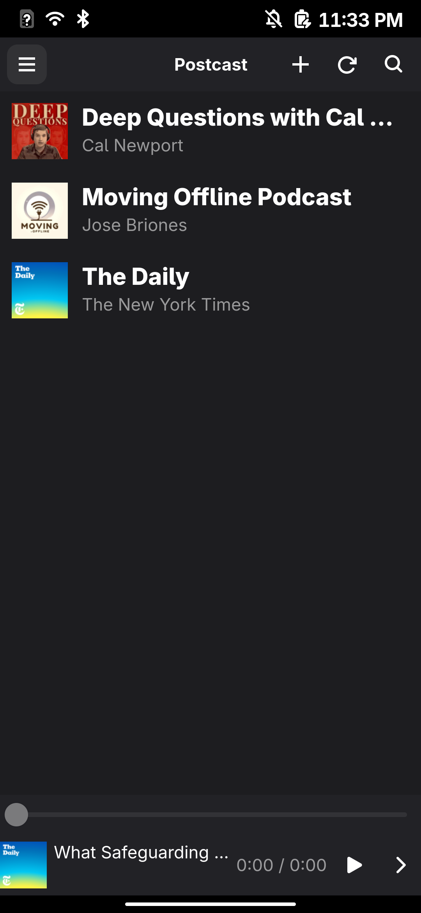
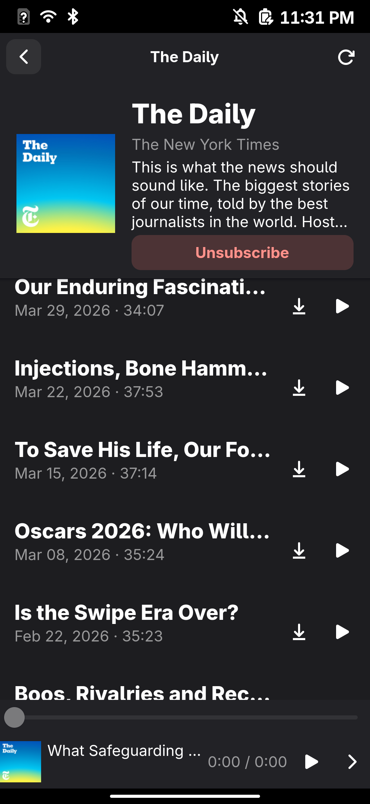

# Postcast

A GTK4 podcast player for [postmarketOS](https://postmarketos.org) and other mobile Linux.

Built with Python + GObject/Gtk, Libadwaita, and GStreamer.

## Screenshots





## Features

- Subscribe to podcasts by RSS/Atom feed URL
- Search the iTunes podcast directory and subscribe from results
- Stream episodes over the network or download them for offline listening
- Resume playback where you left off, per episode
- Auto-advance to the next unplayed episode
- Episode artwork, descriptions, and durations

## Running locally (desktop)

Requirements: Python 3.9+, GTK4, Libadwaita, GStreamer, PyGObject.

On Alpine / postmarketOS:

```sh
sudo apk add gtk4 libadwaita gstreamer gst-plugins-base gst-plugins-good \
     py3-gobject3 py3-feedparser
```

Run from source:

```sh
python3 -m postcast
```

Run the test suite:

```sh
python3 -m pip install feedparser
python3 -m unittest discover -s tests -v
```

## Packaging for postmarketOS

The included `APKBUILD` builds an `apk` for postmarketOS via `pmbootstrap`:

```sh
pmbootstrap build postcast --srcdir=pkg-src/linux-podcast
```

or copy `postcast`, `data/`, `setup.py`, and `APKBUILD` into a pmaports-style
package tree and build with `pmbootstrap`.

## Data locations

| What            | Path                                     |
|-----------------|------------------------------------------|
| Database        | `$XDG_DATA_HOME/io.postcast.Postcast/`   |
| Downloads       | `$HOME/Podcasts/` (configurable)         |
| Artwork cache   | `$XDG_CACHE_HOME/io.postcast.Postcast/`  |

## License

GPL-3.0-or-later
